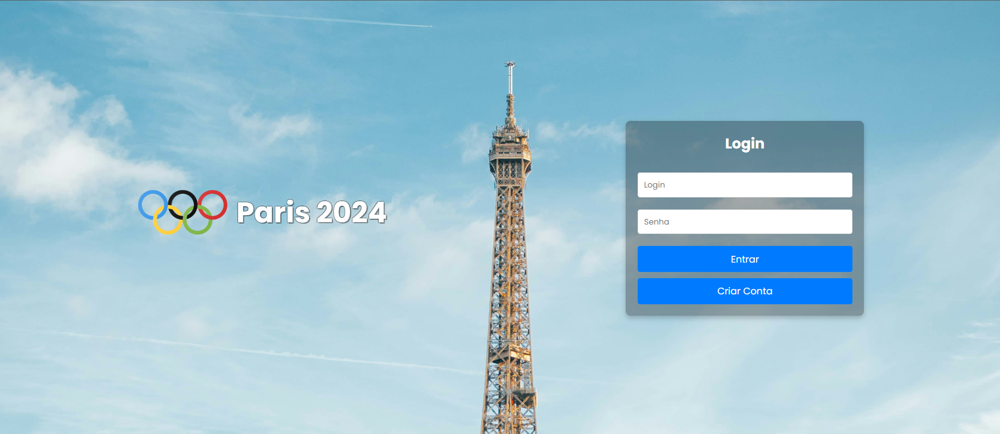
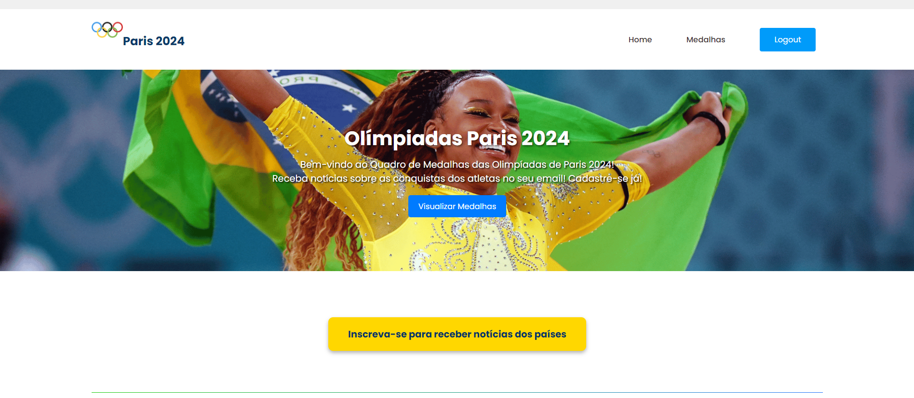
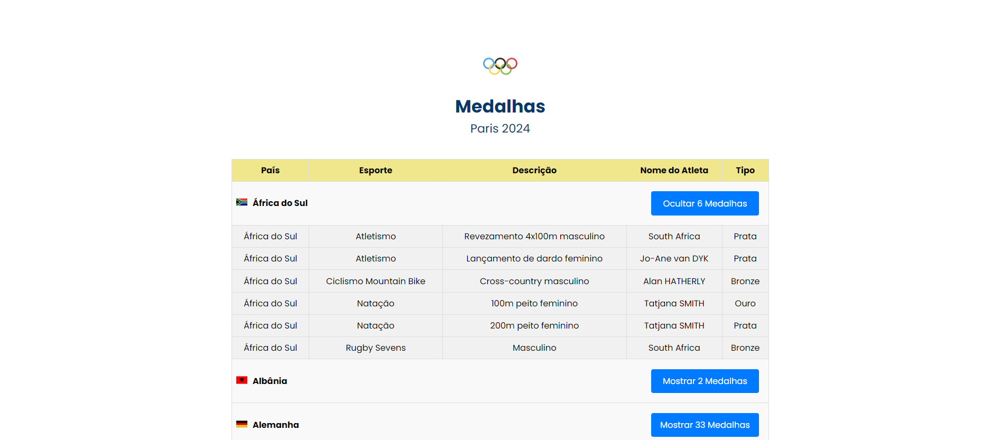
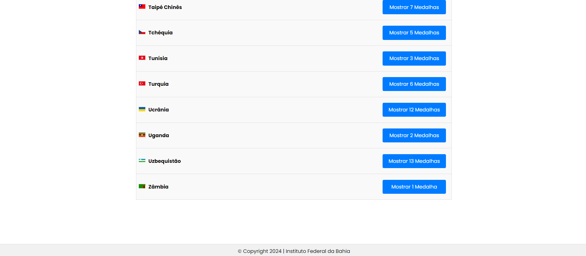
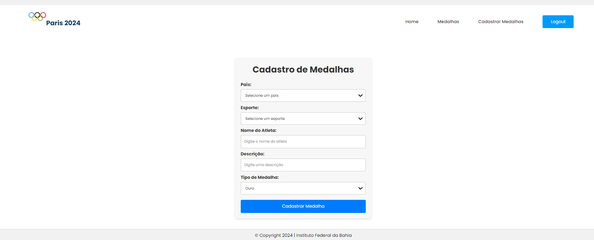

## Paris 2024 Olympics Medal Table Visualization System – React.js

### Introduction
This project was developed for the Web Programming course at IFBA, aiming to build a complete web system that allows users to view the Olympic medal table in real time. The system details the medals won by each country, categorized by sport and type (gold, silver, bronze). Additionally, it offers an email notification system, where registered users can follow specific countries and receive automatic alerts whenever those countries win new medals. The application is built with Spring Boot on the backend and React.js on the frontend.

---

### Main Features

- Medal Table Visualization: Displays the updated medal table, highlighting the medal count per country.

- User sign-up to follow countries of their choice.

- Automatic email alerts when followed countries win new medals.

- Medal Registration: Interface to add new medals, specifying the country, sport, and medal type.

### Technologies Used

- Framework: React.js
- Styling Tools: CSS / Bootstrap

### Telas

